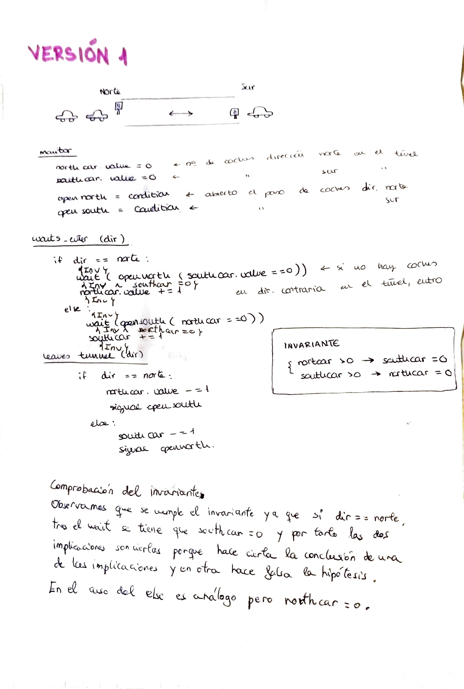
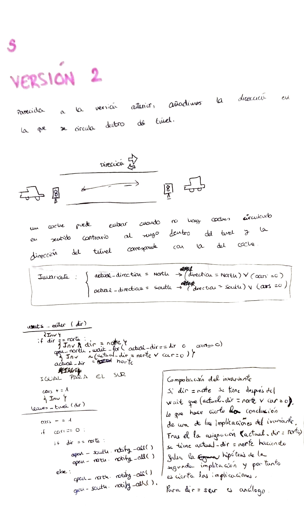
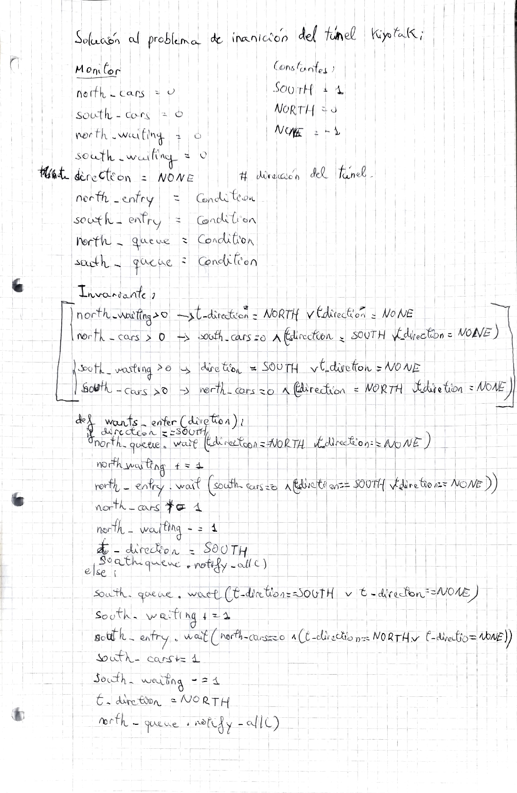
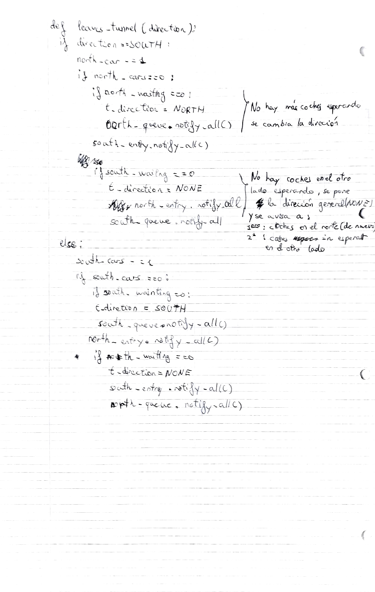

# Tunel de Kiyotaki
***Práctica 2: Túnel de Kiyotaki***

*Simula el funcionamiento de un túnel que permite el paso de coches en una sola dirección.*

## Solución 1 - (01_sol_skel)

Se configura el monitor con dos semáforos. Permite el paso si el numero de coches en la otra dirección es 0.

**Problemas:**    
- Justicia: No se controla el orden de paso de los coches. Por tanto podría pasar que los coches de una dirección se queden esperando hasta que hayan pasado todos los de la otra dirección.
- Los coches de una misma dirección no tienen establecido ningún orden. Un coche esperando en una dirección puede entrar después de otro coche posterior a él en la misma dirección.

***

## Solución 2 - (02_sol_skel)
Similar a la solución 1. 

En este caso, se controla el paso de los coches comprobando la dirección de circulación del tunel de tal manera que se permite el paso si coinciden con la dirección actual o si no hay ningun coche en el túnel en ese momento. Se cambia de dirección cuando hayan salido todos los coches e intente pasar un coche en la dirección opuesta.

No soluciona el problema de justicia todavía.

***

## Solución 3 - (03_sol_skel)
Soluciona el problema de justicia. 

Se utiliza un entero en lugar de una cadena de caracteres para identificar la dirección de coches en el interior del tunel. 
Se inicializa la dirección inicial a -1 (representada por NONE) y se utiliza el 0 y el 1 para representar el norte o el sur, respectivamente.

Se añaden variables compartidas `north_cars` y `south_cars` que nos indican el número de coches que hay dentro del túnel en cada dirección, ademas de `north_waiting` y `south_waiting` que guardan el número de coches que están esperando a entrar en el túnel. 

Se incluyen dos semáforos más, `north_queue` y `south_queue`, que permite que los coches entren en grupos. Esto es, cada direccion puede acumular coches en una cola y dejar el paso a todos ellos en cuando hayan salido los coches en la dirección contraria. Así se puede distribuir el paso en cada dirección en funcion del volumen de coches.

Un coche se pone a la cola para entrar si su dirección es la contraria a la del túnel o no hay dirección establecida todavía. Los coches que estan esperando entran cuando han salido todos los que estén circulando en sentido contrario al suyo.

Cuando el último coche abandona el túnel se abre el paso en la otra dirección. Justo después, para evitar posibles bloqueos si no hay mas coches en dirección contraria, se notifica a los semáforos en la misma dirección para permitir el paso de más coches.

***

## Solución 4 - (04_sol_skel)
Solucionado el problema de justicia. Se inicializa la dirección inicial del túnel a `NONE`. Contamos con variables `north_cars` y `south_cars` que nos indican el número de coches que hay dentro del túnel en cada dirección, y `north_waiting` y `south_waiting` que indican el número de coches que están esperando a entrar en el túnel en cada dirección. Tenemos los siguientes semáforos:
- `north_entry` / `south_entry` para dejar pasar al norte / sur.
- `north_queue` / `south_queue` para dejar pasar al norte / sur a la cola del túnel.

Cuando un coche quiere entrar en el túnel se pone a la cola si su dirección es la contraria a la del túnel o no hay dirección establecida todavía. 
Los coches que estan esperando entran cuando han salido todos los que estén circulando en sentido contrario al suyo y la dirección coincide con la dirección actual del túnel.

Cuando un coche abandona el túnel y no hay coches dentro se comprueba:
- Si no hay coches esperando en la dirección actual, se cambia de dirección y se da paso a la cola de la dirección actual.
- Siempre se da pasa a los coches de la dirección contraria.
- Si no hay coches esperando en la dirección contraria, se da paso primero a los coches de la dirección actual de nuevo, y luego a la cola de la otra dirección

